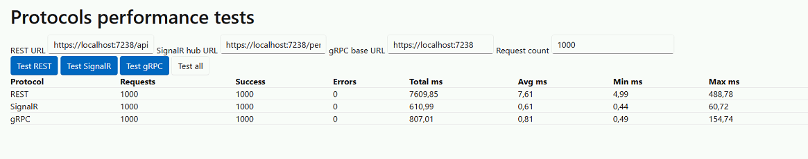

Простое сравнение производительности отправки сообщений через Rest, SignalR, Grpc
Отправка и получения всё на localhost

В качестве модели для передачи использовалась следущая:
```code public sealed class PerfPayload
{
    public Guid Id { get; set; }
    public string Name { get; set; } = string.Empty;
    public int Count { get; set; }
    public double Value { get; set; }
    public bool IsActive { get; set; }
    public DateTime Timestamp { get; set; }
    public string[] Tags { get; set; } = Array.Empty<string>();
    public PerfNested Nested { get; set; } = new();
}
